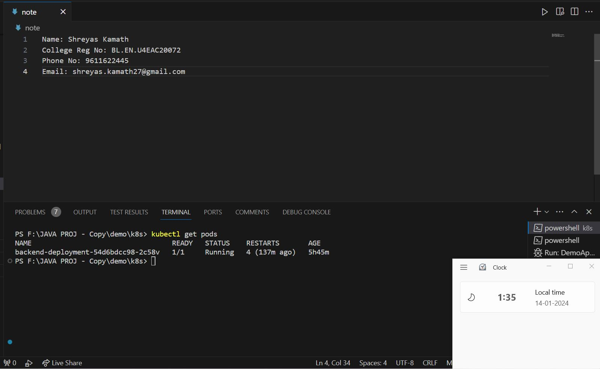

# Task 1: Java REST API

This task involves implementing a Java application providing a REST API for managing "task" objects. Each task object includes specific properties, and a unique property based on the candidate's name.


## Implementation

- GET /tasks: Returns all tasks if no parameters are passed. If a task ID is provided as a parameter, it returns a single task or 404 if not found.
- PUT /tasks: Adds a new task. The task object is passed as a JSON-encoded message body.
- DELETE/tasks/{id}: Deletes a task based on the provided task ID.
- GET /tasks/findByName/{name}: Finds tasks by name. Returns one or more tasks containing the specified string in the name or 404 if nothing is found.

## Mongo Setup

Use MongoDB atlas to connect your JAVA API with atlas cluster. Use mongo uri string provided by atlas and include them in your application.properties file with the correct user credentials.


## Screenshots
1. Create a task (POST Request).


<br>
<br>

2. Show tasks (GET Request).


<br>
<br>

3. Get tasks by id (GET Request).


<br>
<br>

4. Get tasks by wrong id(id doesn't exist in database).


<br>
<p align="center">Here the task with wrong task id API request gave 404 error.</p>

<br>
<br>


5. Get tasks by taskname (GET Request).


<br>
<br>


<p align="center">Here we GET endpoint which is based on taskname which doesn't exist, hence giving 404 error.</p>
<br>
<br>


6.Delete tasks by id (DELETE Request).
<br>


<br>
<br>


7.Update tasks by id (PUT Request).
<br>


<br>
<br>
<br>

## How to run

1. Clone the repository.
```bash
  git clone https://github.com/shreyas2711/Kaiburr.git
```
<br>

2. Configure MongoDB connection (in our project we used MongoDB atlas).

<br>


3. Build the application (we used Maven).

<br>

4. Run the application.

<br>
<br>


# Task 2: Kubernetes

Deploy JAVA application(Spring boot application) to Kubernetes.

1. Dockerize your app:
```bash
  docker build -t your-username/my-spring-backend:<tagname> .
```
<br>
Here, replace "your-username" with your actual Dockerhub username.

<br>

2. Create Kubernetes manifests(Deployment and Service).

```bash
  kubectl apply -f backend-deployment.yaml
```
<br>


3. In our case we I did not create seperate cluster for MongoDb since I used atlas and atlas manages clusters on its won.

<br>

4. Verify deployment

```bash
  kubectl get pods
  kubectl get services
```

<br>


## Screenshots

1. Get pods:



<br>
<br>

2. Get services:


<br>
<br>


3. curl command to retrieve data from server.


<br>
<br>


## Task 3: Web UI Forms

1. Frontend was built using React.js


<br>
<br>

2. Show data based on "taskname" 


<br>
<br>


3. Create a task form page to create tasks front the frontend.


<br>


<br>
<br>


4. You can also delete a task from the UI.


<br>
<br>


## How to run:

1. Navigate to cloned-project-folder/frontend/my-app.

```bash
  cd/frontend/my-app
```

<br>


2. Run the app on your localhost using:

```bash
  npm start
```

<br>
<br>


## Task 4: CI-CD Pipeline

This task involves creating CI/CD pipeline for for the backend server.


1. Create workflow file for your pipeline(backend-ci-cd.yml).

2. Include DOCKERHUB_USERNAME and DOCKERHUB_PASSWORD in workflow file

3. Use Github secret for the repository to store DOCKERHUB_USERNAME and DOCKERHUB_PASSWORD so that while running your workflow using Github actions, Github can directly access the protected credentials of Your Docker hub.

<br>


 ## Screenshots


<br>


